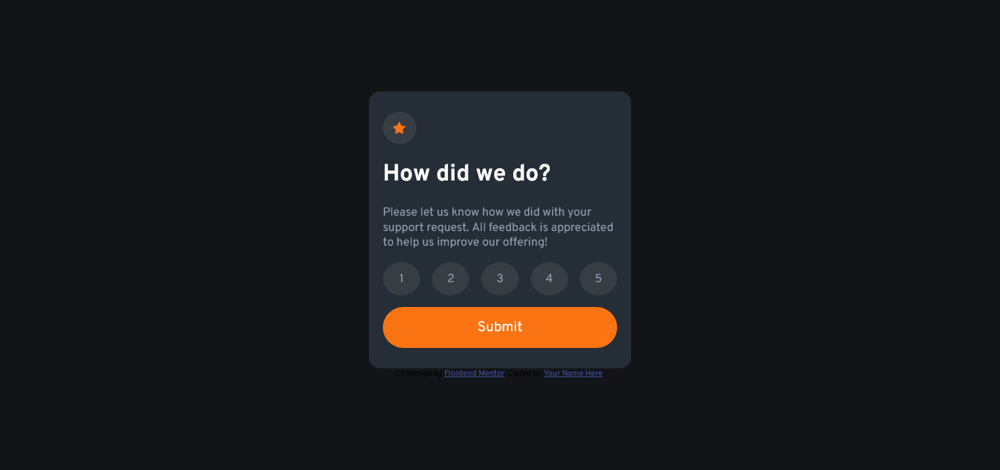

# Frontend Mentor - Interactive rating component solution

This is a solution to the [Interactive rating component challenge on Frontend Mentor](https://www.frontendmentor.io/challenges/interactive-rating-component-koxpeBUmI). Frontend Mentor challenges help you improve your coding skills by building realistic projects.

## Table of contents

- [Overview](#overview)
  - [The challenge](#the-challenge)
  - [Screenshot](#screenshot)
  - [Links](#links)
- [My process](#my-process)
  - [Built with](#built-with)
  - [What I learned](#what-i-learned)
  - [Continued development](#continued-development)
- [Author](#author)

## Overview

### The challenge

Users should be able to:

- View the optimal layout for the app depending on their device's screen size
- See hover states for all interactive elements on the page
- Select and submit a number rating
- See the "Thank you" card state after submitting a rating

### Screenshot



### Links

- Solution URL: [Add solution URL here](https://your-solution-url.com)
- Live Site URL: [Add live site URL here](https://your-live-site-url.com)

## My process

### Built with

- Semantic HTML5 markup
- CSS custom properties
- Flexbox
- CSS Grid
- Mobile-first workflow
- [React](https://reactjs.org/) - JS library
- [Vite] (https://vitejs.dev/) - JS Bundler

### What I learned

I learned how to create a multiple choice/unique choice selector using ReactJS.

```js
const handleClick = (e) => {
  setRating(e.currentTarget.textContent);
  setIsRatingSelected(true);
};

useEffect(() => {
  if (rating === selectedRating) {
    setIsActive(true);
  } else {
    setIsActive(false);
  }
}, [selectedRating]);
```

### Continued development

I'd like to focus on improving my code and maintaining it as clean as possible. As well as better use of frameworks and libraries features.

## Author

- GitHub - [branalex94](https://github.com/branalex94)
- Frontend Mentor - [@branalex94](https://www.frontendmentor.io/profile/branalex94)
- LinkedIn - [Brandon Aray](https://www.linkedin.com/in/brandon-aray-269b63230/)
